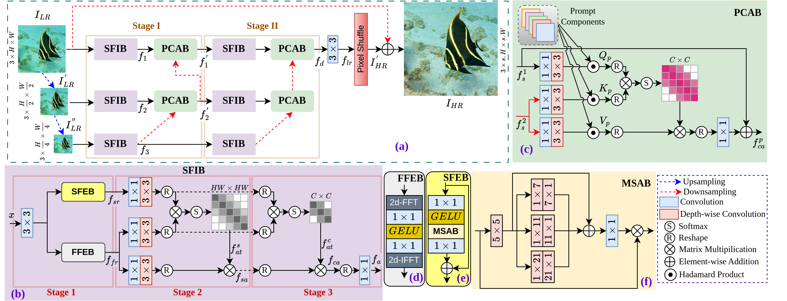

# Efficient-USR: Prompt guided Dual-Domain feature information for efficient underwater image super-resolution

**Paper Link: [https://ieeexplore.ieee.org/document/10889519](https://ieeexplore.ieee.org/document/10889519)**

**This paper has been accepted at the 50th IEEE International Conference on Acoustics, Speech, and Signal Processing (ICASSP 2025).**

**The official repository with Pytorch**



## Installation

**Python 3.9.12**

- create a virtual environment
``` bash
python3 -m venv ./venv_name
```

- activate virtual environment
``` bash
source venv_name/bin/activate
```

- install dependencies  
``` bash
pip3 install torch torchvision opencv-python matplotlib pyyaml tqdm tensorboardX tensorboard einops thop
```

## Train  
- Train the Efficient-USR on [UFO-120](https://drive.google.com/drive/folders/153laK_iRsyKkWN_qZztAyH3309WNKqsI) dataset.
``` bash
python train.py -v "UFO_2X_32" -p train --train_yaml "train_UFO120_x2_32.yaml"
python train.py -v "UFO_3X_32" -p train --train_yaml "train_UFO120_x3_32.yaml"
python train.py -v "UFO_4X_32" -p train --train_yaml "train_UFO120_x4_32.yaml"
```
- Train the Efficient-USR on [USR-248](https://drive.google.com/drive/folders/1dCe5rlw3UpzBs25UMXek1JL0wBBa697Q) dataset.
``` bash
python train.py -v "USR_2X_32" -p train --train_yaml "train_USR248_x2_32.yaml"
python train.py -v "USR_4X_32" -p train --train_yaml "train_USR248_x4_32.yaml"
python train.py -v "USR_8X_32" -p train --train_yaml "train_USR248_x8_32.yaml"
```

## Fine-tune  
``` bash
python train.py -v "UFO_2X_32" -p finetune --ckpt 277
```

## Test
**Test the Efficient-USR model using UFO-120 and USR-248 datasets.**

-- | UFO | --  |  | -- | USR | --
--- | --- | --- | --- | --- | --- | ---
Scale | Version | Epoch | |Scale | Version | Epoch
2x | UFO_2X_32 | 277 | |2x | USR_2X_32 | 238
3x | UFO_3X_32 | 300 | |3x | USR_4X_32 | 274
4x | UFO_4X_32 | 300 | |4x | USR_8X_32 | 292

- e.g.,
``` bash
python test.py -v "UFO_2X_32" --checkpoint_epoch 277 -t tester_Matlab --test_dataset_name "UFO-120"
```
- provide dataset path in env/env.json file  
- other configurations are done using yaml files
## Citation
```
@inproceedings{pramanick2025efficient,
  title={Efficient-USR: Prompt Guided Dual-Domain Feature Information for Efficient Underwater Image Super-Resolution},
  author={Pramanick, Alik and Bheda, Utsav and Sur, Arijit},
  booktitle={ICASSP 2025-2025 IEEE International Conference on Acoustics, Speech and Signal Processing (ICASSP)},
  pages={1--5},
  year={2025},
  organization={IEEE}
}
```
## Acknowledgement
- [https://github.com/Alik033/ML-CrAIST](https://github.com/Alik033/ML-CrAIST)
- [https://github.com/Francis0625/Omni-SR](https://github.com/Francis0625/Omni-SR)
